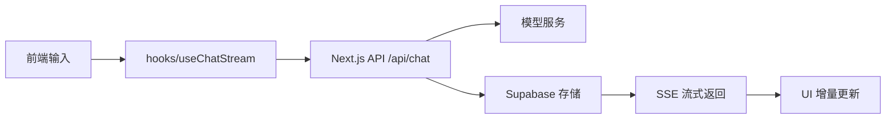

# my-chat

AI 聊天应用原型，基于 Next.js + Supabase + Clerk 构建，支持流式对话、会话持久化和基础安全治理，适合用于个人项目展示、面试演示及公开仓库展示。

## 项目简介

my-chat 是一个以聊天为核心的 Web 应用，目标是提供近实时的 AI 对话体验，并将会话内容、访问控制和接口安全一并纳入工程设计。它适合用于个人助手、知识问答、聊天机器人原型等场景，也可以作为 Next.js + AI 应用的代码示例进行展示。

## 核心功能

- 流式 AI 对话：使用 Server-Sent Events 逐 token 返回模型输出，提升响应体验
- 会话管理：支持创建、切换、删除多个聊天会话
- 聊天记录持久化：消息和会话元数据保存在 Supabase 中
- 安全与限流：校验请求参数，并在 API 层实施基础速率限制
- Markdown 渲染：支持列表、代码块、表格等富文本展示

## 技术栈

| 类别 | 技术项 | 说明 |
| --- | --- | --- |
| 框架 | Next.js 16 | App Router 与服务端 API 能力 |
| 前端 | React 19 + TypeScript | 组件化 UI 与类型安全 |
| 样式 | Tailwind CSS | 快速构建现代 UI |
| 数据库 | Supabase | 会话与消息存储 |
| 认证 | Clerk | 用户身份校验与访问控制 |
| AI 接口 | SiliconFlow / OpenAI 兼容接口 | 大语言模型调用入口 |
| 部署 | Vercel | Next.js 项目的推荐托管平台 |
| 校验 | Zod | 请求参数校验 |

## 环境变量配置

本项目在本地开发时需要通过 `.env.local` 配置环境变量，部署到 Vercel 时也需要在后台 Environment Variables 中配置同名变量。

```bash
cp .env.example .env.local
```

| 变量名 | 说明 | 是否必填 | 是否公开到前端 |
| --- | --- | --- | --- |
| `NEXT_PUBLIC_SUPABASE_URL` | Supabase 项目 URL | 是 | 是 |
| `NEXT_PUBLIC_SUPABASE_ANON_KEY` | Supabase 匿名键，仅用于公开访问场景 | 是 | 是 |
| `SUPABASE_SERVICE_ROLE_KEY` | Supabase service role key，仅服务端使用 | 是 | 否 |
| `NEXT_PUBLIC_CLERK_PUBLISHABLE_KEY` | Clerk 前端公钥 | 是 | 是 |
| `CLERK_SECRET_KEY` | Clerk 服务端密钥 | 是 | 否 |
| `SILICONFLOW_API_KEY` | SiliconFlow 模型调用密钥 | 是 | 否 |
| `SILICONFLOW_BASE_URL` | SiliconFlow 接口地址 | 是 | 否 |
| `NEXT_PUBLIC_APP_URL` | 当前应用访问地址 | 否 | 是 |
| `AI_MODEL` | 默认模型名称 | 否 | 否 |
| `AI_MAX_TOKENS` | 最大输出长度 | 否 | 否 |
| `AI_TEMPERATURE` | 生成温度参数 | 否 | 否 |
| `AI_TOP_P` | Top-p 参数 | 否 | 否 |

> 安全说明：`NEXT_PUBLIC_` 前缀的变量会在构建时被嵌入前端代码，因此只能使用匿名级公开配置，绝不能把 service role key、API key 或高权限凭据放入此类变量中。
>
> 所有真实密钥必须只存放在本地 `.env.local` 和 Vercel 后台的 Environment Variables 中，不得提交到 GitHub 仓库。

## 本地运行

```bash
git clone <repository-url>
cd my-chat
npm install
cp .env.example .env.local
npm run dev
```

访问：

```text
http://localhost:3000
```

## 架构简述

请求链路如下：



核心流程为：前端输入交给 hook 处理，服务端 API 负责校验用户身份和请求参数，并将模型输出流式写回；系统同时更新会话与消息记录，最终在前端按 token 追加渲染。

## 部署说明

本项目以 Vercel 作为部署平台，GitHub 仓库的 `main` 分支更新后，将触发 Vercel 的自动部署流程。

部署到 Vercel 后，需要在后台进入：

`Project -> Settings -> Environment Variables`

并配置以下变量，并根据需要选择作用域（Production / Preview / Development）：

- `NEXT_PUBLIC_SUPABASE_URL`
- `NEXT_PUBLIC_SUPABASE_ANON_KEY`

配置完成后，必须执行一次 Redeploy，环境变量修改才会生效。

> 注意：`NEXT_PUBLIC_` 变量会在构建时被内联到前端代码，因此它们需要是公开可见的匿名配置，不能放入高权限秘钥。

## 安全声明

- 所有真实密钥仅存于本地 `.env.local` 和 Vercel 后台环境变量中
- 不提交 `.env.local`、`.env.*.local` 或任何真实凭据到 GitHub
- 本仓库仅保留示例值或占位符，不包含真实的 Supabase 地址、API Key 或服务端密码

## 许可证

本项目采用 MIT License，详情请见 [LICENSE](./LICENSE)。
